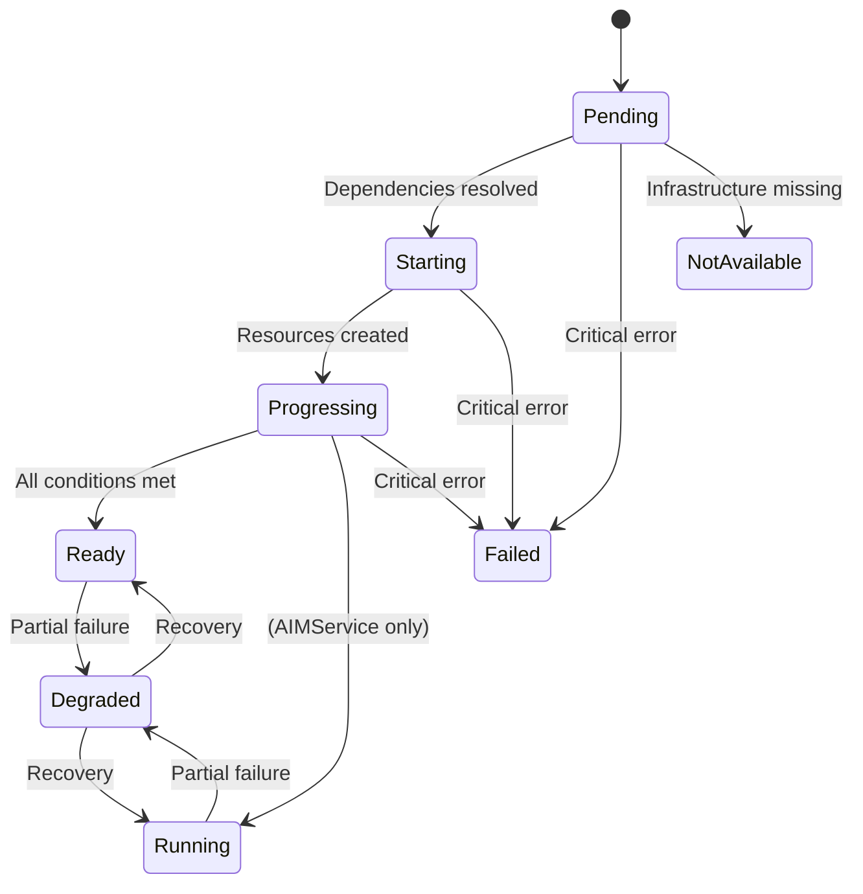

# Resource Lifecycle

This page describes how AIM Engine manages resource ownership, status transitions, and cleanup behavior.

## Ownership Model

AIM Engine uses Kubernetes owner references to express resource relationships. When an owner is deleted, its owned resources are garbage collected automatically.

```
AIMServiceTemplate
    └── AIMTemplateCache (owned by template)
            └── AIMArtifact (owned by template cache)
                    └── PVC + Download Job (owned by artifact)

AIMService
    └── InferenceService (owned by service)
    └── HTTPRoute (owned by service)
```

Key behaviors:

- **Template caches** are owned by templates, not services. This allows cache reuse across services.
- **Auto-created models** (via `model.image`) have no owner reference. They persist for reuse by other services.

## Status Transitions

All AIM resources follow a common status progression:



| Status | Priority | Description |
|--------|----------|-------------|
| `Running` | 7 | Fully operational (AIMService only) |
| `Ready` | 6 | Resource is ready |
| `Progressing` | 5 | Creating downstream resources |
| `Starting` | 4 | Dependencies resolved, beginning work |
| `Pending` | 3 | Waiting for dependencies |
| `Degraded` | 2 | Partially functional |
| `NotAvailable` | 1 | Required infrastructure not present |
| `Failed` | 0 | Critical failure |

AIMService maps `Progressing` → `Starting` and `Ready` → `Running` for clarity.

## Conditions

The reconciliation framework manages a standard set of conditions on every resource:

| Condition | Description |
|-----------|-------------|
| `DependenciesReachable` | All upstream dependencies exist and are accessible |
| `AuthValid` | Authentication and authorization are valid |
| `ConfigValid` | Resource configuration is valid |
| `Ready` | Overall readiness |

AIMService adds component-specific conditions:

| Condition | Description |
|-----------|-------------|
| `ModelReady` | Model resolved and ready |
| `TemplateReady` | Template resolved and ready |
| `RuntimeConfigReady` | Runtime config resolved |
| `InferenceServiceReady` | KServe InferenceService is ready |
| `InferenceServicePodsReady` | Inference pods are running |
| `CacheReady` | Model cache is ready |
| `HTTPRouteReady` | HTTPRoute is configured |
| `HPAReady` | KEDA autoscaling is configured |

## Finalizers

AIM Engine uses finalizers to handle cleanup that can't be done through owner references alone.

### AIMService Finalizer

**Finalizer:** `aim.eai.amd.com/template-cache-cleanup`

When a service is deleted, the finalizer removes non-Ready template caches that were created by this service. Ready caches are preserved for reuse by other services.

### AIMTemplateCache Finalizer

**Finalizer:** `aim.eai.amd.com/artifactcleanup`

When a template cache is deleted, the finalizer removes non-Ready artifacts. Ready artifacts with completed downloads are preserved.

### Namespace Deletion

Finalizers do not block namespace deletion. Kubernetes handles namespace termination by force-removing finalizers on resources within the namespace.

## Validation

AIM Engine validates resources at two levels: admission time and reconciliation time.

### Admission Validation (Immediate)

CRD schemas include [CEL validation rules](https://kubernetes.io/docs/tasks/extend-kubernetes/custom-resources/custom-resource-definitions/#validation-rules) that run when you `kubectl apply`. Invalid resources are rejected immediately by the API server.

Key immutability rules (cannot be changed after creation):

| CRD | Immutable Field | Error Message |
|-----|----------------|---------------|
| AIMService | `spec.model` | Model selection is immutable after creation |
| AIMService | `spec.template` | Template selection is immutable after creation |
| AIMService | `spec.caching` | Caching mode is immutable after creation |
| AIMArtifact | `spec.sourceUri` | sourceUri is immutable |
| AIMServiceTemplate | `spec.modelName` | Model name is immutable |
| All templates | `spec.metric`, `spec.precision`, `spec.hardware` | Immutable after creation |

Key structural rules:

| CRD | Rule |
|-----|------|
| AIMService | Exactly one of `model.name`, `model.image`, or `model.custom` must be specified |
| AIMService (custom) | At least one model source required |
| Hardware | At least one of `gpu` or `cpu` must be specified |
| GPU | `model` and `minVram` are mutually exclusive |

### Reconciliation Validation (Eventual)

Domain logic validation runs during reconciliation and surfaces as condition updates:

- Reference resolution (model not found, template not found)
- Template selection (ambiguous, no candidates)
- Image URI validation
- Path template resolution

These appear as condition changes rather than immediate API errors. Check `ConfigValid` and component conditions for reconciliation-time validation failures.

!!! note
    AIM Engine does **not** use admission webhooks. All immediate validation is via CEL rules in the CRD schema. The webhook flags in the operator binary exist for potential future use.

## Discovery and Download Jobs

AIM Engine creates short-lived Kubernetes Jobs for template discovery and model artifact operations. These are the transient pods you may see in your namespaces.

### Discovery Jobs

Created when a template needs to discover its runtime profiles from a model container image.

| Property | Value |
|----------|-------|
| **Name pattern** | `discover-{template}-{hash}` |
| **Container** | `discovery` — runs the model image with `dry-run --format=json` |
| **Created when** | Template is not Ready and has no inline model sources |
| **Duration** | Varies (depends on image startup time) |
| **Cleanup** | TTL 60 seconds after completion; also garbage-collected when parent template is deleted |
| **Retries** | BackoffLimit 0 (immediate fail); controller retries with exponential backoff (60s base, 3600s max) |
| **Concurrency** | Max 10 concurrent discovery jobs per reconcile |
| **Labels** | `aim.eai.amd.com/template`, `app.kubernetes.io/component: discovery` |

For cluster-scoped templates, discovery jobs run in the operator namespace.

### Check-Size Jobs

Created when an AIMArtifact needs to discover the model size before provisioning a PVC.

| Property | Value |
|----------|-------|
| **Name pattern** | `{artifact}-check-size-{hash}` |
| **Container** | `check-size` — runs `/check-size.sh` with the source URI |
| **Created when** | `spec.size` is not set and size hasn't been discovered yet |
| **Duration** | Seconds (HTTP HEAD request) |
| **Cleanup** | TTL 5 minutes after completion |
| **Retries** | BackoffLimit 2 |
| **Labels** | `aim.eai.amd.com/cache.type: artifact`, `aim.eai.amd.com/component: check-size` |

### Download Jobs

Created when an AIMArtifact needs to download model data to a PVC.

| Property | Value |
|----------|-------|
| **Name pattern** | `{artifact}-download-{hash}` |
| **Container** | `download` — runs the artifact downloader image |
| **Created when** | PVC is bound and download hasn't completed |
| **Duration** | Minutes to hours (depends on model size and protocol) |
| **Labels** | `aim.eai.amd.com/cache.type: artifact`, `aim.eai.amd.com/component: model-storage` |

### Model Source Scanning

`AIMClusterModelSource` does **not** create jobs. Registry scanning runs inside the operator process using HTTP calls to container registry APIs.

## Next Steps

- [Architecture](../getting-started/architecture.md) — High-level component overview
- [AIM Services](services.md) — Service deployment lifecycle
- [Model Caching](caching.md) — Cache ownership and deletion behavior
