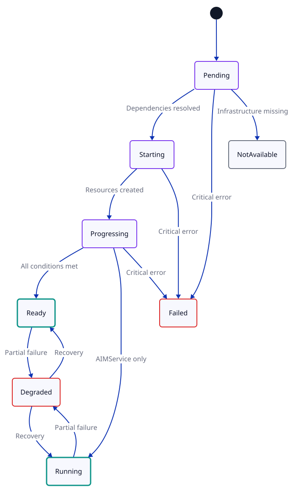

# Resource Lifecycle

This page describes how AIM Engine manages resource ownership, status transitions, finalizers, and cleanup behaviour.

## Ownership model

AIM Engine uses Kubernetes owner references to express resource relationships. When an owner is deleted, its owned resources are garbage collected automatically.

### v1alpha2 graph

```
AIMModel / AIMClusterModel  (spec.image — official / base-image flow)
    ├── Discovery Job + ConfigMap (owned by model)
    └── AIMProfile / AIMClusterProfile  (owned by model)
            └── AIMProfileCache  (owned by profile only when spec.caching.enabled)
                    └── AIMArtifact  (owned by cache in Dedicated mode; orphan in Shared)
                            └── PVC + Download Job  (owned by artifact)

AIMModel / AIMClusterModel  (spec.profiles — fine-tune / custom-model flow)
    └── AIMProfileSet / AIMClusterProfileSet  (owned by model)
            └── AIMProfile / AIMClusterProfile  (owned by profile set)
                    └── ... (same as above)

AIMService
    ├── AIMProfile  (only when spec.profileOverrides — overlay; owned by service)
    ├── AIMProfileCache  (only in Dedicated mode; owned by service)
    ├── InferenceService  (owned by service)
    └── HTTPRoute  (only when spec.routing.enabled; owned by service)
```

Key behaviours:

- **Shared profile caches** have no owner reference. They persist across services for reuse.
- **Dedicated profile caches and their artifacts** are owner-referenced by the service and garbage-collected with it.
- **AIMProfile resources** are owner-referenced by the producing `AIMModel` (for image discovery) or `AIMProfileSet` (for derivation). User-authored profiles have no AIM controller owner.
- **Auto-created models**:
    - v1alpha1 `spec.model.image` path: no owner reference; the model persists for reuse by other services.
    - v1alpha2 `spec.model.image` path (requires the `aim.eai.amd.com/reconciler-pipeline: profile` annotation): owner-referenced by the originating service and garbage-collected with it. Named `<service>-auto-<6charHash(image)>`. See [Services → By image](services.md#by-image).

### v1alpha1 graph (legacy)

```
AIMServiceTemplate
    └── AIMTemplateCache  (owned by template, Shared mode)
            └── AIMArtifact  (owned by cache only in Dedicated mode)
                    └── PVC + Download Job  (owned by artifact)

AIMService (template path)
    ├── AIMTemplateCache  (owned by service only in Dedicated mode)
    ├── InferenceService  (owned by service)
    └── HTTPRoute  (owned by service)
```

The same Shared/Dedicated split applies to legacy `AIMTemplateCache` as to `AIMProfileCache`. See [Service Templates (v1alpha1)](../legacy/service-templates.md).

## Status transitions

All AIM resources follow a common status progression:

<picture>
  <source media="(prefers-color-scheme: dark)" srcset="../assets/diagrams/status-transitions-dark.svg">
  
</picture>

| Status | Priority | Description |
|---|---|---|
| `Running` | 7 | Fully operational (AIMService only) |
| `Ready` | 6 | Resource is ready |
| `Progressing` | 5 | Creating downstream resources |
| `Starting` | 4 | Dependencies resolved, beginning work |
| `Pending` | 3 | Waiting for dependencies |
| `Degraded` | 2 | Partially functional |
| `NotAvailable` | 1 | Required infrastructure not present |
| `Failed` | 0 | Critical failure |

AIMService maps `Progressing` → `Starting` and `Ready` → `Running` for clarity in `kubectl` output.

## Conditions

The reconciliation framework manages a standard set of conditions on every resource:

| Condition | Description |
|---|---|
| `DependenciesReachable` | All upstream dependencies exist and are accessible |
| `AuthValid` | Authentication and authorization are valid |
| `ConfigValid` | Resource configuration is valid |
| `Ready` | Overall readiness rollup |

Component-specific conditions are added per CRD. See [Conditions](../reference/conditions.md) for the full catalogue; the v1alpha2 highlights:

| CRD | Conditions added |
|---|---|
| `AIMService` (v1alpha2) | `ProfileReady`, `ProfileCacheReady`, `InferenceServiceReady`, `HTTPRouteReady`, `HPAReady` |
| `AIMService` (v1alpha1) | `ModelReady`, `TemplateReady`, `RuntimeConfigReady`, `CacheReady`, `InferenceServiceReady`, `HTTPRouteReady`, `HPAReady` |
| `AIMModel` / `AIMClusterModel` | `DiscoveryReady` (image flows) or `DerivationReady` (derivation flows) |
| `AIMProfileSet` / `AIMClusterProfileSet` | `DerivationReady` |
| `AIMProfile` / `AIMClusterProfile` | `HardwareAvailable` |
| `AIMProfileCache` | `ProfileFound`, `ArtifactsReady` |
| `AIMArtifact` | `RuntimeConfigReady`, `StorageQuotaReady`, `StorageQuotaExceeded`, `CachePvcReady`, `DownloadJobReady`, `DownloadJobPodsReady`, `DownloadComplete` |

## Finalizers

AIM Engine uses finalizers to handle cleanup that can't be expressed through owner references alone.

### AIMService finalizer

**Finalizer:** `aim.eai.amd.com/cache-cleanup`

When an AIMService is deleted, the finalizer removes any non-Ready caches the service created (by label). Ready caches are preserved so subsequent services can reuse them.

This applies to both v1alpha2 `AIMProfileCache` and v1alpha1 `AIMTemplateCache` — the finalizer enumerates caches by service-name label, regardless of cache kind.

### AIMProfileCache finalizer

**Finalizer:** `aim.eai.amd.com/artifactcleanup`

When a profile cache is deleted, the finalizer removes any non-Ready artifacts it created (by label). Ready shared artifacts persist so they can be reused by other caches.

### AIMTemplateCache finalizer (legacy)

**Finalizer:** `aim.eai.amd.com/artifactcleanup`

Identical behaviour to the profile-cache finalizer. Cleans up non-Ready artifacts when the template cache is deleted.

### Namespace deletion

Finalizers do **not** block namespace deletion. Kubernetes handles namespace termination by force-removing finalizers on resources within the namespace.

## Validation

AIM Engine validates resources at two levels: admission time and reconciliation time.

### Admission validation (immediate)

CRD schemas include [CEL validation rules](https://kubernetes.io/docs/tasks/extend-kubernetes/custom-resources/custom-resource-definitions/#validation-rules) that run when you `kubectl apply`. Invalid resources are rejected immediately by the API server.

#### Immutability

| CRD | Immutable fields |
|---|---|
| `AIMService` | `spec.model`, `spec.profile.name`, `spec.template`, `spec.caching` |
| `AIMProfile` / `AIMClusterProfile` | `spec.aimId`, `spec.modelId`, `spec.acceleratorModel`, `spec.acceleratorType`, `spec.acceleratorCount`, `spec.precision`, `spec.metric`, `spec.engine` |
| `AIMArtifact` | `spec.sourceUri` |
| `AIMServiceTemplate` (legacy) | `spec.modelName`, `spec.metric`, `spec.precision`, `spec.hardware` |

#### Structural rules (v1alpha2)

| CRD | Rule |
|---|---|
| `AIMModel` / `AIMClusterModel` | Exactly one of `spec.image` or `spec.profiles` |
| `AIMModel` / `AIMClusterModel` | `spec.aimId`, `spec.modelSources`, `spec.custom`, `spec.customTemplates`, `spec.profileCopy`, `spec.discovery`, `spec.defaultServiceTemplate`, `spec.runtimeConfigName`, `spec.env`, `spec.imageMetadata` are forbidden |
| `AIMService` | At least one of `spec.model` or `spec.profile` |
| `AIMService` | `spec.profile.name` and `spec.profile.selector` are mutually exclusive |
| `AIMService` | `spec.profile.selector.role: base` is forbidden |
| `AIMService` | `spec.profile.selector` requires `aimId`, `modelRef`, or paired `spec.model` |
| `AIMService` | `spec.profileOverrides` requires `spec.profile.name` |
| `AIMService` | `spec.template` is forbidden on v1alpha2 (rejected by CEL `!has(spec.template)`); use `spec.profile` or `spec.model` |
| `AIMProfile` / `AIMClusterProfile` | `spec.aimId` and `spec.modelSources` must be both populated or both empty |
| `AIMProfileSet` / `AIMClusterProfileSet` | `spec.selector` requires at least one selector field |
| `AIMProfileSet` / `AIMClusterProfileSet` | `versionPolicy: pinned` requires `version` |

#### Structural rules (v1alpha1, legacy)

| CRD | Rule |
|---|---|
| `AIMService` | Exactly one of `model.name`, `model.image`, or `model.custom` must be specified |
| `AIMService` (custom) | At least one model source required |
| `AIMServiceTemplate` | At least one of `hardware.gpu` or `hardware.cpu` must be specified |
| `hardware.gpu` | `model` and `minVram` are mutually exclusive |

### Reconciliation validation (eventual)

Domain logic validation runs during reconciliation and surfaces as condition updates:

- Reference resolution (model not found, profile not found, template not found)
- Selector evaluation (no matching profiles, ambiguous candidates)
- Image URI validation
- Path template resolution

These appear as condition changes rather than immediate API errors. Check `ConfigValid` and component conditions for reconciliation-time validation failures.

:::{note}
AIM Engine does **not** use admission webhooks. All immediate validation is via CEL rules in the CRD schema. The webhook flags in the operator binary exist for potential future use.
:::
## Discovery and download jobs

AIM Engine creates short-lived Kubernetes Jobs for image discovery and model artifact operations. These are the transient pods you may see in your namespaces.

### Discovery jobs (v1alpha2)

Created when an `AIMModel` / `AIMClusterModel` needs to inspect a container image and produce a normalised discovery catalog.

| Property | Value |
|---|---|
| **Name pattern** | `{model}-discovery-{hash}-job` |
| **Container** | `discovery` — runs the model image with `dry-run --format=json` |
| **Created when** | Model uses `spec.image` and `status.discoveryCacheRef` is empty or its `specHash` is stale |
| **Duration** | Varies (depends on image startup time, typically seconds to a minute) |
| **Cleanup** | TTL 60 seconds after completion; also garbage-collected when parent model is deleted |
| **Retries** | `backoffLimit: 0` (immediate fail); controller retries with exponential backoff (60s base, 3600s max) |
| **Concurrency** | Max 10 concurrent discovery jobs per reconcile |
| **Labels** | `aim.eai.amd.com/model`, `app.kubernetes.io/component: discovery` |

For cluster-scoped models, discovery jobs run in the operator namespace (typically `aim-system`).

### Discovery jobs (v1alpha1, legacy)

Same shape as above but parented to an `AIMServiceTemplate` instead of an `AIMModel`. Labels use `aim.eai.amd.com/template` and the name pattern is `discover-{template}-{hash}`.

### Check-size jobs

Created when an `AIMArtifact` needs to discover the model size before provisioning a PVC.

| Property | Value |
|---|---|
| **Name pattern** | `{artifact}-check-size-{hash}` |
| **Container** | `check-size` — runs `/check-size.sh` with the source URI |
| **Created when** | `spec.size` is not set and size hasn't been discovered yet |
| **Duration** | Seconds (HTTP HEAD request) |
| **Cleanup** | TTL 5 minutes after completion |
| **Retries** | `backoffLimit: 2` |
| **Labels** | `aim.eai.amd.com/cache.type: artifact`, `aim.eai.amd.com/component: check-size` |

### Download jobs

Created when an `AIMArtifact` needs to download model data to a PVC.

| Property | Value |
|---|---|
| **Name pattern** | `{artifact}-download-{hash}` |
| **Container** | `download` — runs the artifact downloader image |
| **Created when** | PVC is bound and download hasn't completed |
| **Duration** | Minutes to hours (depends on model size and protocol) |
| **Labels** | `aim.eai.amd.com/cache.type: artifact`, `aim.eai.amd.com/component: model-storage` |

### Model source scanning

`AIMClusterModelSource` does **not** create jobs. Registry scanning runs inside the operator process using HTTP calls to container registry APIs.

## Next steps

- [Architecture](../getting-started/architecture.md) — High-level component overview
- [AIM Services](services.md) — Service deployment lifecycle
- [AIM Models](models.md) — Model onboarding flows
- [Model Caching](caching.md) — Cache ownership and deletion behaviour
- [Conditions](../reference/conditions.md) — Full condition catalogue
