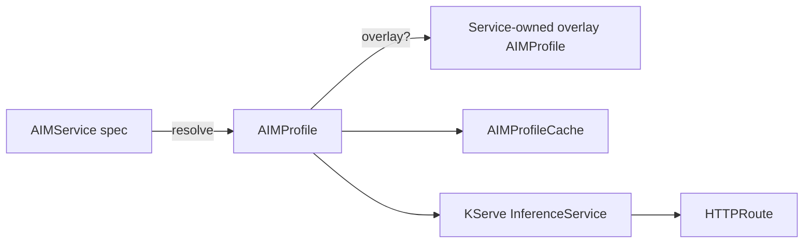

# AIM Services

`AIMService` is the resource you create to deploy an inference endpoint. It binds an `AIMProfile` (the runtime configuration) to optional service-level concerns — caching, routing, autoscaling, resources — and produces a KServe `InferenceService` plus an optional Gateway API `HTTPRoute`.

!!! info "v1alpha2"
    This page documents the `aim.eai.amd.com/v1alpha2` API. For the v1alpha1 `spec.template` shape see [Legacy AIMService](../legacy/aimservice-v1alpha1.md).

## Lifecycle



On every reconcile the controller:

1. **Resolves a profile** — by name, by selector, or by treating `spec.model.name` as a shortcut for "every deployable profile produced by that model".
2. **Materialises an overlay AIMProfile** if `spec.profileOverrides` is set.
3. **Pre-warms the cache** by creating an `AIMProfileCache` for the resolved profile (when caching is enabled).
4. **Builds an InferenceService** mounting the cache PVC, the profile's container image, env, and resource requirements.
5. **Creates an HTTPRoute** if routing is enabled and a `gatewayRef` is configured.
6. **Reports component health** in `status.conditions` and the high-level `status.status` rollup.

## Resolution shapes

A v1alpha2 `AIMService` reaches a deployable `AIMProfile` through one of five shapes. They share the same `spec.model` / `spec.profile` fields but combine them differently.

| Shape | Spec | Use case |
|---|---|---|
| [**By name**](#by-name) | `spec.profile.name` | You know exactly which profile to deploy |
| [**By model**](#by-model) | `spec.model.name` | You know the model; let the controller pick the best deployable profile |
| [**Model + selector**](#model--selector) | `spec.model.name` + `spec.profile.selector` | Narrow a model's profile pool by precision / accelerator / engine |
| [**Global selector**](#global-selector) | `spec.profile.selector` (no `spec.model`) | Reach profiles via labels — `aimId` or `modelRef` required |
| [**By image**](#by-image) | `spec.model.image` + `aim.eai.amd.com/reconciler-pipeline: profile` annotation | One-shot deploy straight from a container image; the controller looks up or auto-creates an `AIMModel` for that image |

In all shapes the controller ranks the surviving candidates by `primary > type > version` and resolves to a single profile. The resolved profile is recorded in `status.resolvedProfile` (name, scope, kind, uid).

### By name

The lowest-friction shape — references a specific `AIMProfile` or `AIMClusterProfile`.

```yaml
apiVersion: aim.eai.amd.com/v1alpha2
kind: AIMService
metadata:
  name: qwen-chat
  namespace: ml-team
spec:
  profile:
    name: qwen-qwen3-32b-mi300x-fp8-latency
```

Resolution order is namespace first (`AIMProfile`), then cluster (`AIMClusterProfile`). Namespace wins.

### By model

You name the model, the controller picks the profile. This is the recommended default.

```yaml
spec:
  model:
    name: qwen-qwen3-32b
```

`spec.model.name` is shorthand for `spec.profile.selector.modelRef.name` plus the implicit `role=Deployable` filter. The candidate pool is every deployable profile owned by that AIMModel (or AIMClusterModel of the same name). Ranking selects the best.

### Model + selector

Narrow a model's profile pool by hardware or engine criteria.

```yaml
spec:
  model:
    name: qwen-qwen3-32b
  profile:
    selector:
      precision: fp8
      acceleratorModel: MI300X
      metric: latency
```

The selector adds AND filters on top of the model-derived `modelRef.name`. Any selector field documented under [Profile Selectors](profilesets.md#selector) is supported except `role` (see below).

### Global selector

Reach profiles via labels alone, without anchoring to a model.

```yaml
spec:
  profile:
    selector:
      aimId: qwen/qwen3-32b
      precision: fp8
      acceleratorModel: MI300X
```

The CRD requires at least one of `selector.aimId` or `selector.modelRef.name` so the controller's watch fan-out can find this service via O(1) label indexes.

### By image

For one-shot deploys when you only have an AIM container image. Requires the migration-window annotation to opt into the v1alpha2 profile pipeline (the legacy v1alpha1 template pipeline is the default for image-only services until v1alpha1 is removed — see [Migration window](../admin/upgrading.md#migration-window)).

```yaml
apiVersion: aim.eai.amd.com/v1alpha2
kind: AIMService
metadata:
  name: qwen-chat
  namespace: ml-team
  annotations:
    aim.eai.amd.com/reconciler-pipeline: profile
spec:
  model:
    image: amdenterpriseai/aim-qwen-qwen3-32b:0.8.5
```

The resolver looks up an existing `AIMModel`/`AIMClusterModel` whose `spec.image` matches. If exactly one matches, the resolver treats it as if you had written `spec.model.name: <that model>` and ranks as usual. If none matches, the plan step **creates a dedicated, service-owned `AIMModel`** in the service's namespace with:

- `metadata.ownerReferences` pointing at the service (garbage collected with the service).
- Label `aim.eai.amd.com/origin=auto-generated`.
- Annotation `aim.eai.amd.com/auto-source=spec.model.image`.

If multiple existing models match the same image (rare; not recommended), the resolver reports `ProfileNotFound` and asks you to disambiguate via `spec.model.name`.

Image-shape services pair best with `caching.mode: Shared` only when you intentionally apply a long-lived `AIMModel` for the image and reference it via `spec.model.name` instead — auto-created models are per-service.

### Reserved selector fields

`spec.profile.selector.role` is **reserved** on `AIMService`. The controller forces `role: deployable` at evaluation time. Omitting the field is fine; explicitly setting `role: deployable` is fine; setting `role: base` (or any other value) is rejected at admission.

This guarantees a service never resolves to a base profile.

## Profile binding stability

The resolver is **sticky-once-bound**: once `status.resolvedProfile` is set, the controller keeps using that profile on every subsequent reconcile, provided the profile still exists and still satisfies the current selector.

This protects running services from silently switching profiles when the candidate pool changes for reasons unrelated to the service spec. The classic trigger is adding a second `AIMModel` in the same namespace with overlapping `aimId` — without stickiness, the ranker might pick a different-precision profile from the newer model and rebind the running service to fp8 weights when it was happily serving fp16, complete with a fresh cache download and a predictor pod roll.

### When the binding is re-evaluated automatically

A natural rebind happens when the existing binding is no longer usable:

| Trigger | Mechanism |
|---|---|
| Bound profile deleted | The `Get` for `status.resolvedProfile` returns NotFound → re-rank against remaining candidates. |
| Bound profile no longer matches the current selector | The user narrowed `spec.profile.selector` (or `spec.model.name` changed) and the bound profile no longer passes the filter → re-rank with the new intent. |
| Bound profile drops below the `minimumType` floor | The bound profile's `type` is now below the selector's `minimumType` (e.g. retyped to `unoptimized` while the floor is `optimized`) → re-rank. |
| Transient infrastructure error fetching the bound profile | Re-rank rather than risk serving a stale binding through an outage. |

Each natural rebind emits a `Normal` event with reason `ProfileRebound` naming the previous profile, the new profile, and the trigger reason — so `kubectl describe aimservice` always tells you why a binding changed.

### Forcing a rebind explicitly

When you intentionally want the resolver to pick again (e.g. an image upgrade landed a new published profile and you want the service to adopt it), set the `aim.eai.amd.com/force-rebind` annotation to any non-empty value:

```bash
kubectl annotate aimservice my-svc \
  aim.eai.amd.com/force-rebind=now --overwrite
```

On the next reconcile the resolver ignores the sticky binding, re-ranks from scratch, and (if the winner differs) emits the same `ProfileRebound` event with `force-rebind` as the reason.

The operator does NOT clear the annotation. Remove it once the desired rebind has happened to return to sticky behavior:

```bash
kubectl annotate aimservice my-svc aim.eai.amd.com/force-rebind-
```

Leaving the annotation in place is safe — the ranker is deterministic and `ProfileRebound` only fires when the winner actually changes — but it forgoes the stability guarantee of the sticky default, so the next time a higher-ranked candidate appears the service will silently adopt it.

### Pinning to a specific profile

Stickiness is a default-on protection, not a guarantee. The strongest guarantee is `spec.profile.name`: by name there's no ranking at all, so the binding is fixed for the lifetime of the spec.

## Profile overlays

Sometimes you want to tweak a published profile for one service without forking it. `spec.profileOverrides` creates a service-owned **overlay AIMProfile** derived from `spec.profile.name`:

```yaml
spec:
  profile:
    name: qwen-qwen3-32b-fp8-mi300x
  profileOverrides:
    modelSources:
      - modelId: my-org/qwen3-32b-finetune
        sourceUri: hf://my-org/qwen3-32b-finetune
    containerEnv:
      - name: AIM_OVERRIDE_NOTE
        value: "service overlay rebases the seed profile onto custom weights"
```

What happens:

1. The controller materialises an `AIMProfile` named `<seed>-<service>-overlay-<hash>` in the service's namespace.
2. The overlay carries `profile-role: deployable`, `profile-origin: derived`, and an annotation pointing back at the service.
3. Downstream (cache, ConfigMap, KServe wiring) keys off the overlay — so the override participates in cache-key computation, not just runtime env wiring.
4. The overlay is owner-referenced by the service and garbage-collected on service deletion.

The override field set mirrors [`ProfileOverrides`](profilesets.md#overrides) used by AIMProfileSet derivation — the same internal primitive applies both.

`spec.profileOverrides` requires `spec.profile.name`; it can't be combined with a selector-based resolution shape.

## Caching

When the resolved profile has `spec.caching.enabled: true` (namespace-scoped profiles only) or the service has its own `spec.caching` block, the controller creates an `AIMProfileCache` that pre-downloads the profile's `modelSources` onto a PVC before the InferenceService starts.

| Mode | Behavior |
|---|---|
| `Shared` (default) | The cache PVC is shared across services using the same profile. Reused indefinitely; outlives any single service. |
| `Dedicated` | Each service gets its own cache PVC, garbage-collected with the service. |

```yaml
spec:
  caching:
    mode: Dedicated
```

See [Model Caching](caching.md) for the full hierarchy (AIMProfileCache → AIMArtifact → PVC + Download Job).

## Resources and replicas

| Field | Description |
|---|---|
| `replicas` | Fixed replica count. Default `1`. |
| `minReplicas` / `maxReplicas` | Enables KEDA-driven autoscaling between the bounds. |
| `autoScaling` | Custom metric configuration (typically vLLM OTEL metrics). See [Scaling and Autoscaling](../guides/scaling-and-autoscaling.md). |
| `resources` | Optional override for container resources. Merged on top of the resolved profile's `status.resources`. |
| `imagePullSecrets` | Service-level secrets, merged with the profile's. |
| `serviceAccountName` | Pod service account for the inference workload. |
| `priorityClassName` | Pod priority class. |

## Routing

Optionally expose the service through Gateway API:

```yaml
spec:
  routing:
    enabled: true
    gatewayRef:
      name: inference-gateway
      namespace: gateways
    pathTemplate: "/team/{.metadata.labels['team']}/chat"
```

The controller creates an `HTTPRoute` that attaches to the referenced Gateway. The `pathTemplate` supports JSONPath expressions referencing service metadata. See [Routing and Ingress](../guides/routing-and-ingress.md).

## Status

### High-level status

| Status | Meaning |
|---|---|
| `Pending` | Resolving the profile or waiting on upstream dependencies |
| `Starting` | Profile resolved; creating cache and InferenceService |
| `Running` | InferenceService is ready and serving traffic |
| `Degraded` | Partially functional — typically routing or cache issues with a healthy inference path |
| `Failed` | Terminal error preventing deployment |

### Status fields

| Field | Description |
|---|---|
| `resolvedProfile` | The profile that was resolved (`name`, `scope`, `kind`, `uid`). The single source of truth for which profile is backing this service. |
| `resolvedRuntimeConfig` | The runtime config (if any) that contributed defaults |
| `cache` | Cache state — `profileCacheRef` (v1alpha2 profile pipeline) or `templateCacheRef` (v1alpha1 template pipeline), `retryAttempts` |
| `runtime` | Replica counts when autoscaling is active (`currentReplicas`, `desiredReplicas`, `minReplicas`, `maxReplicas`) |
| `routing` | Observed routing including the rendered HTTP path |
| `conditions` | Per-component conditions — see below |

### Conditions

The v1alpha2 service reports these component conditions:

| Condition | What it tracks |
|---|---|
| `ProfileReady` | Profile resolution (`ProfileResolved`, `ProfileNotFound`, `BaseProfile`) |
| `ProfileCacheReady` | `AIMProfileCache` artifact downloads |
| `InferenceServiceReady` | KServe `InferenceService` readiness |
| `HTTPRouteReady` | Gateway API route acceptance (only when routing is enabled) |
| `HPAReady` | KEDA-managed autoscaler health (only when autoscaling is enabled) |
| `Ready` | Aggregate of all above |

When `ProfileReady=False` (profile not found, or resolved to a base profile), the controller **suppresses** the downstream `InferenceServiceReady` / `HTTPRouteReady` entries — those resources aren't being created until the profile resolves, so reporting them as "Creating" would be misleading.

See [Conditions Reference](../reference/conditions.md) for the full reason catalogue.

## Validation

CEL admission rules reject a handful of v1alpha1-isms outright:

| Rejected on v1alpha2 | Use instead |
|---|---|
| `spec.template` (any value) | `spec.profile` (or `spec.model`) |
| `spec.overrides` | `spec.profileOverrides` |
| Neither `spec.model` nor `spec.profile` | Set at least one |
| `spec.profileOverrides` without `spec.profile.name` | Provide `spec.profile.name` |
| `spec.profile.selector.role: base` | Omit `role` or set `deployable` |
| `spec.profile.selector` without `aimId`, `modelRef`, or paired `spec.model` | Add one of those anchor fields |

See [Resource lifecycle → validation](resource-lifecycle.md#validation) for the canonical list of validation rules across all v1alpha2 CRDs.

## Examples

### Minimal deploy by name

```yaml
apiVersion: aim.eai.amd.com/v1alpha2
kind: AIMService
metadata:
  name: qwen-chat
  namespace: ml-team
spec:
  profile:
    name: qwen-qwen3-32b-mi300x-fp8-latency
```

### Auto-select for a model, with autoscaling

```yaml
apiVersion: aim.eai.amd.com/v1alpha2
kind: AIMService
metadata:
  name: qwen-chat
  namespace: ml-team
spec:
  model:
    name: qwen-qwen3-32b
  minReplicas: 1
  maxReplicas: 5
  autoScaling:
    metrics:
      - type: PodMetric
        podmetric:
          metric:
            backend: opentelemetry
            metricNames:
              - vllm:num_requests_running
            query: "vllm:num_requests_running"
            operationOverTime: avg
          target:
            type: Value
            value: "1"
```

Autoscaling between `minReplicas` and `maxReplicas` requires at least one metric (or `minReplicas: 0` for scale-from-zero); otherwise the spec is rejected with `ConfigValid=False` (reason `AutoscalingRequiresMetrics`).

### Custom weights via overlay

```yaml
apiVersion: aim.eai.amd.com/v1alpha2
kind: AIMService
metadata:
  name: qwen-finetune
  namespace: ml-team
spec:
  profile:
    name: qwen-qwen3-32b-mi300x-fp8-latency
  profileOverrides:
    modelSources:
      - modelId: acme/qwen3-32b-finetune
        sourceUri: hf://acme/qwen3-32b-finetune
```

### Selector with HTTP routing

```yaml
apiVersion: aim.eai.amd.com/v1alpha2
kind: AIMService
metadata:
  name: qwen-chat
  namespace: ml-team
spec:
  profile:
    selector:
      aimId: qwen/qwen3-32b
      precision: fp8
      acceleratorModel: MI300X
      metric: latency
  routing:
    enabled: true
    gatewayRef:
      name: inference-gateway
      namespace: gateways
```

## Troubleshooting

### Service stuck in `Pending` with `ProfileNotFound`

The resolver found no candidates. Check:

```bash
kubectl get aimservice <name> -o jsonpath='{.status.conditions[?(@.type=="ProfileReady")].message}'
```

Common causes:

- `spec.profile.name` typo or wrong scope (namespace vs cluster).
- `spec.model.name` doesn't match any AIMModel/AIMClusterModel that has produced deployable profiles. Check `kubectl get aimmodel <name> -o jsonpath='{.status.managedProfiles}'`.
- Selector is too restrictive — relax `precision`, `acceleratorModel`, or `acceleratorCount`.

### Service `ProfileReady=False / BaseProfile`

`spec.profile.name` points at a base profile (status.deployable=false). Base profiles can't back services directly — either reference a deployable profile, or derive a deployable one through a custom-model AIMModel ([Custom Models](../guides/custom-models.md)) and reference that.

### Service is `Running` but throughput is unexpected

The resolved profile may not be the one you expected. Check `status.resolvedProfile`:

```bash
kubectl get aimservice <name> -o jsonpath='{.status.resolvedProfile}'
```

If the wrong profile was selected, narrow `spec.profile.selector` (or switch to `spec.profile.name`) to pin the choice.

## Related documentation

- [Deploying Services](../guides/deploying-services.md) — Task-oriented walkthroughs
- [Profiles](profiles.md) — What `AIMProfile` carries; provenance and status fields
- [AIM Models](models.md) — Three model flows that produce profiles for services to resolve
- [Model Caching](caching.md) — Cache modes and storage configuration
- [Scaling and Autoscaling](../guides/scaling-and-autoscaling.md) — KEDA integration and metric backends
- [Routing and Ingress](../guides/routing-and-ingress.md) — Gateway API patterns
- [Conditions Reference](../reference/conditions.md) — Full condition catalogue
- [CRD API Reference (v1alpha2)](../reference/api/v1alpha2.md) — Full schema
