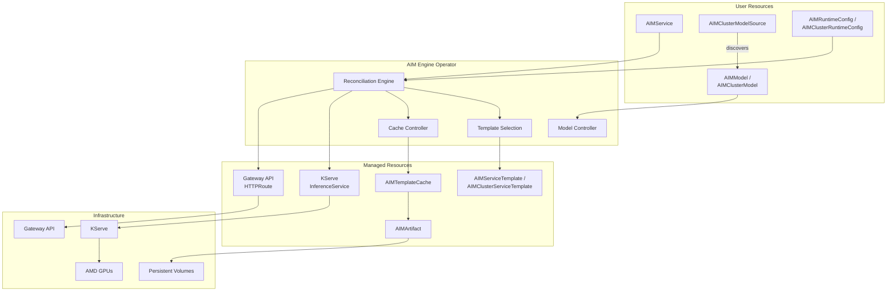
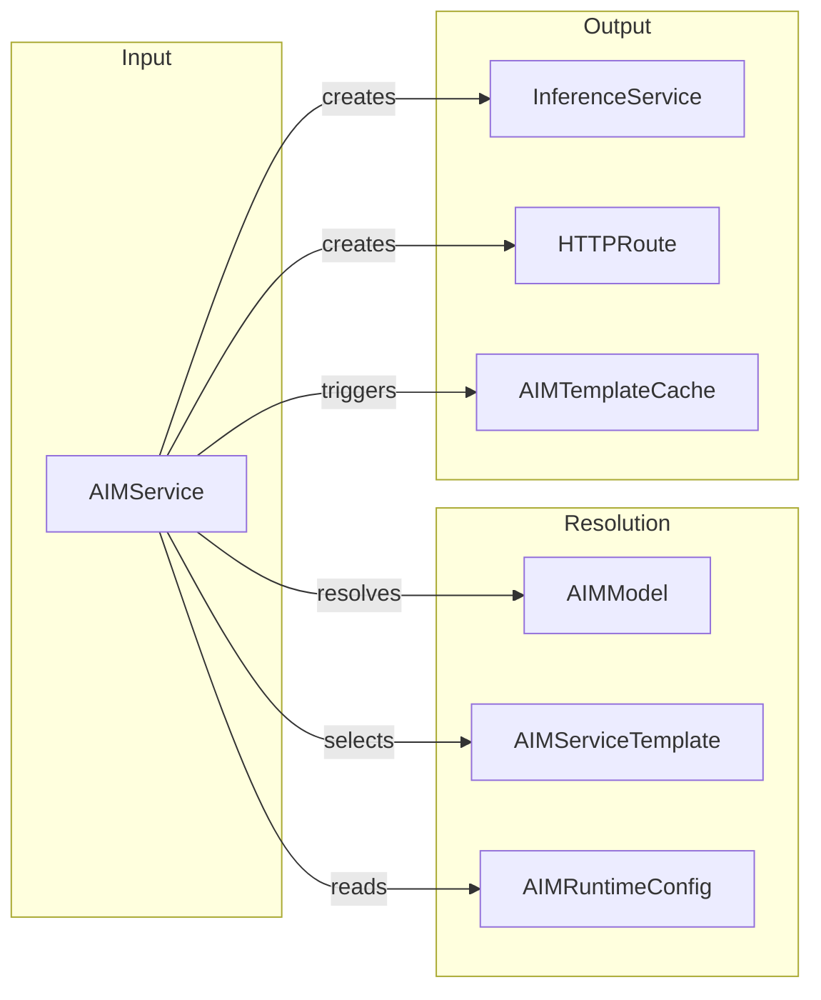
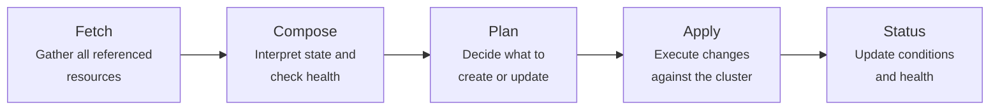

# Architecture

AIM Engine is a Kubernetes operator that orchestrates the full lifecycle of AI inference workloads. It bridges the gap between model artifacts and production-ready inference endpoints by coordinating several Kubernetes-native components.

## High-Level Architecture



## Resource Relationships

The diagram below shows how AIM resources relate to each other during a typical service deployment:



## Component Overview

| Component | Purpose | Scope |
|-----------|---------|-------|
| **AIMService** | Primary resource for deploying inference endpoints | Namespace |
| **AIMModel** / **AIMClusterModel** | Maps model names to container images | Namespace / Cluster |
| **AIMServiceTemplate** / **AIMClusterServiceTemplate** | Defines runtime profiles (GPU, precision, optimization) | Namespace / Cluster |
| **AIMRuntimeConfig** / **AIMClusterRuntimeConfig** | Provides storage defaults, routing, and environment variables | Namespace / Cluster |
| **AIMClusterModelSource** | Discovers models automatically from container registries | Cluster |
| **AIMArtifact** | Manages model artifact downloads to persistent volumes | Namespace |

## Cluster vs Namespace Scoping

Several CRDs have both a namespace-scoped and a cluster-scoped variant:

| Namespace-Scoped | Cluster-Scoped | Purpose |
|-----------------|----------------|---------|
| `AIMModel` | `AIMClusterModel` | Model definitions |
| `AIMServiceTemplate` | `AIMClusterServiceTemplate` | Runtime profiles |
| `AIMRuntimeConfig` | `AIMClusterRuntimeConfig` | Storage, routing, and environment defaults |

**Cluster-scoped** resources are shared across all namespaces. A cluster admin creates them to provide platform-wide defaults: a model catalog, validated runtime profiles, and shared configuration.

**Namespace-scoped** resources are visible only within their namespace. Teams create them for custom models, per-project overrides, or private configurations.

### Resolution Order

When an AIMService needs a model, template, or config, AIM Engine resolves the reference in this order:

1. **Namespace** — look for the resource in the service's namespace
2. **Cluster** — if not found, fall back to the cluster-scoped variant

Namespace always wins. This lets teams override any cluster default by creating a namespace resource with the same name.

**RuntimeConfig** is special: if both namespace and cluster configs exist, they are **merged** rather than one replacing the other. Namespace values override cluster values for any fields that are set in both.

The resolution scope (`Namespace`, `Cluster`, or `Merged`) is recorded in the AIMService status so you can see which scope was used:

```bash
kubectl get aimservice <name> -o jsonpath='{.status.resolvedModel.scope}'
```

## Reconciliation Flow

When an `AIMService` is created or updated, the operator follows this pipeline:



Each step is designed to be idempotent: the operator converges toward the desired state on every reconciliation loop, handling partial failures and eventual consistency gracefully.

## Integration Points

**KServe** provides the underlying model serving runtime. AIM Engine creates and manages `InferenceService` resources, translating its high-level configuration into KServe-native specs.

**Gateway API** handles HTTP routing. When routing is enabled, AIM Engine creates `HTTPRoute` resources that expose inference endpoints through a configured Gateway.

**Persistent Volumes** back the caching system. Model artifacts are downloaded once to shared PVCs and reused across service replicas and restarts.

**AMD GPUs** are detected via node labels. The template selection algorithm filters candidates based on available GPU hardware in the cluster.
