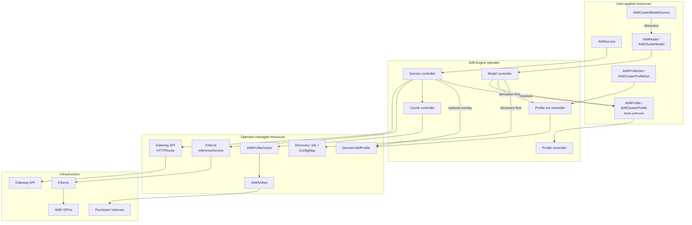
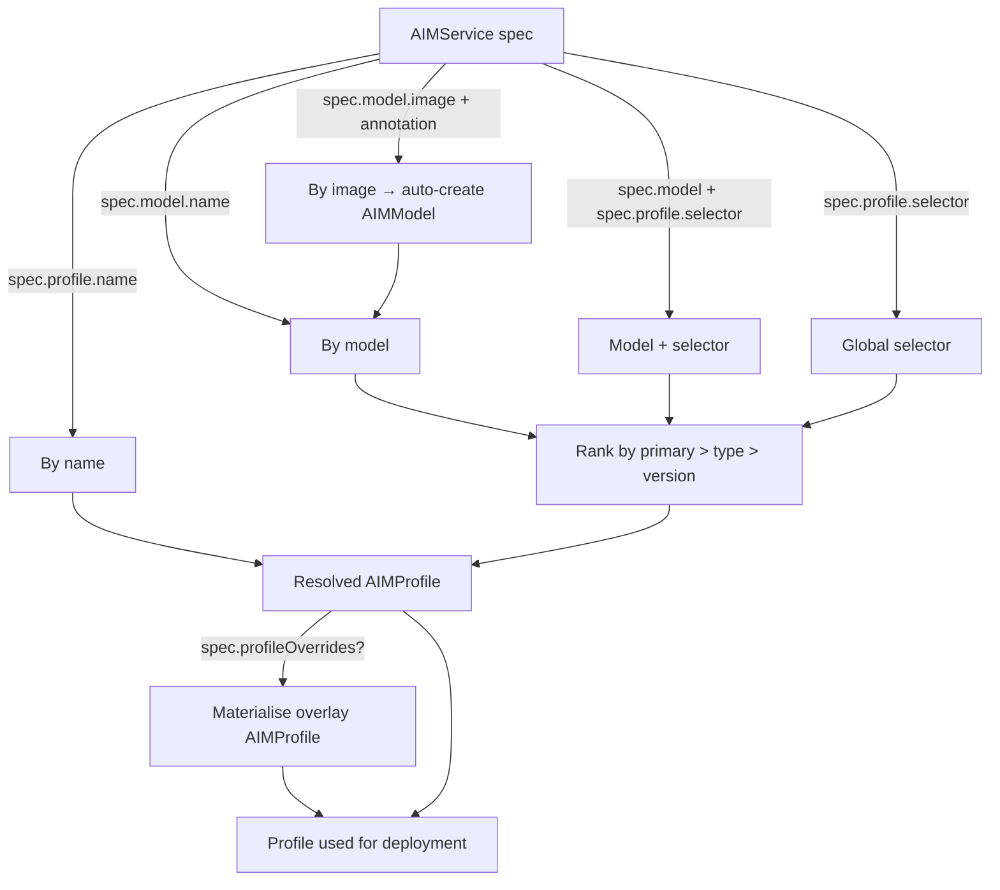
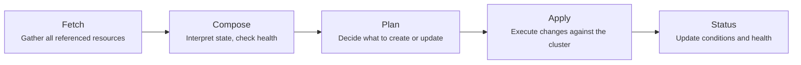

# Architecture

AIM Engine is a Kubernetes operator that orchestrates the full lifecycle of AI inference workloads on AMD GPUs. It bridges the gap between model artifacts and production-ready inference endpoints by coordinating several Kubernetes-native components.

## High-level architecture

```mermaid
graph TB
    subgraph User["User-applied resources"]
        AIMService["AIMService"]
        AIMModel["AIMModel /<br/>AIMClusterModel"]
        ModelSource["AIMClusterModelSource"]
        ProfileSet["AIMProfileSet /<br/>AIMClusterProfileSet"]
        Profile["AIMProfile /<br/>AIMClusterProfile<br/><small>(hand-authored)</small>"]
    end

    subgraph Operator["AIM Engine operator"]
        direction TB
        ModelCtrl["Model controller"]
        ProfileSetCtrl["Profile-set controller"]
        ProfileCtrl["Profile controller"]
        ServiceCtrl["Service controller"]
        CacheCtrl["Cache controller"]
    end

    subgraph Managed["Operator-managed resources"]
        DerivedProfile["Derived AIMProfile"]
        DiscoveryJob["Discovery Job +<br/>ConfigMap"]
        ProfileCache["AIMProfileCache"]
        Artifact["AIMArtifact"]
        ISVC["KServe<br/>InferenceService"]
        HTTPRoute["Gateway API<br/>HTTPRoute"]
    end

    subgraph Infra["Infrastructure"]
        KServe["KServe"]
        GatewayAPI["Gateway API"]
        PVC["Persistent Volumes"]
        GPU["AMD GPUs"]
    end

    AIMModel --> ModelCtrl
    ModelSource -->|discovers| AIMModel
    ProfileSet --> ProfileSetCtrl

    ModelCtrl -->|discovery flow| DiscoveryJob
    ModelCtrl -->|derivation flow| ProfileSetCtrl
    ProfileSetCtrl --> DerivedProfile
    ModelCtrl --> Profile
    Profile --> ProfileCtrl

    AIMService --> ServiceCtrl
    ServiceCtrl -->|resolves| Profile
    ServiceCtrl -->|optional overlay| DerivedProfile
    ServiceCtrl --> CacheCtrl
    CacheCtrl --> ProfileCache
    ProfileCache --> Artifact
    Artifact --> PVC
    ServiceCtrl --> ISVC
    ServiceCtrl --> HTTPRoute

    ISVC --> KServe
    HTTPRoute --> GatewayAPI
    KServe --> GPU
```

## CRDs and their roles

v1alpha2 is the current API. v1alpha1 resources remain supported during the deprecation window — see [Legacy v1alpha1](../legacy/index.md).

| CRD | Scope | Role |
|---|---|---|
| `AIMService` | Namespace | Deploys an inference endpoint by resolving a profile and creating a KServe InferenceService. |
| `AIMModel` / `AIMClusterModel` | Namespace / Cluster | Onboards a model — three flows (official, fine-tuned, custom). Produces profiles. |
| `AIMProfile` / `AIMClusterProfile` | Namespace / Cluster | Self-contained runtime configuration (image, accelerator, engine args, model sources). The unit a service resolves to. |
| `AIMProfileSet` / `AIMClusterProfileSet` | Namespace / Cluster | Derives profiles by selector + overrides. Usually synthesised by `AIMModel.spec.profiles`, also usable standalone. |
| `AIMProfileCache` | Namespace | Pre-warms a profile's `modelSources` to a PVC for fast service start. |
| `AIMArtifact` | Namespace | Manages a single model artifact download to a PVC. |
| `AIMClusterModelSource` | Cluster | Auto-discovers AIM models from a container registry. |
| `AIMRuntimeConfig` / `AIMClusterRuntimeConfig` | Namespace / Cluster | Storage defaults, routing defaults, environment defaults. |

## Three model flows

Every `AIMModel` resolves to one of three flows, selected by which spec field is set. The full mechanics live in [AIM Models](../concepts/models.md):

| Flow | Spec | Source of profiles |
|---|---|---|
| **Official** | `spec.image` (AIM image) | Image discovery — profile YAMLs inside the container |
| **Fine-tuned** | `spec.profiles.derivedFrom` (selecting deployable profiles) | A previously-applied official AIMModel |
| **Custom** | `spec.profiles.derivedFrom` (selecting base-image base profiles) | A previously-applied base-image AIMModel |

CRD validation enforces "exactly one of `spec.image` or `spec.profiles`" — neither can be set, both cannot be set.

## Service resolution

When you apply an `AIMService`, the controller reaches a single `AIMProfile` through one of five resolution shapes:

```mermaid
flowchart TD
    Spec[AIMService spec] -->|spec.profile.name| Name[By name]
    Spec -->|spec.model.name| Model[By model]
    Spec -->|spec.model + spec.profile.selector| ModelSel[Model + selector]
    Spec -->|spec.profile.selector| Selector[Global selector]
    Spec -->|spec.model.image + annotation| ImageShape[By image &rarr; auto-create AIMModel]

    Name --> Resolved[Resolved AIMProfile]
    Model --> Rank[Rank by primary > type > version]
    ModelSel --> Rank
    Selector --> Rank
    ImageShape --> Model
    Rank --> Resolved

    Resolved -->|spec.profileOverrides?| Overlay[Materialise overlay AIMProfile]
    Overlay --> Final[Profile used for deployment]
    Resolved --> Final
```

The image shape requires the `aim.eai.amd.com/reconciler-pipeline: profile` annotation during the migration window — see [Migration window](../admin/upgrading.md#migration-window). See [Services](../concepts/services.md#resolution-shapes) for the canonical resolution table and mechanics.

## Cluster vs namespace scope

Several CRDs have both a namespace-scoped and a cluster-scoped variant.

| Namespace | Cluster | Purpose |
|---|---|---|
| `AIMModel` | `AIMClusterModel` | Model definitions |
| `AIMProfile` | `AIMClusterProfile` | Runtime configurations |
| `AIMProfileSet` | `AIMClusterProfileSet` | Profile derivation |
| `AIMRuntimeConfig` | `AIMClusterRuntimeConfig` | Storage, routing, environment defaults |

**Cluster-scoped** resources are shared across all namespaces. Platform admins create them to provide a model catalog and validated runtime profiles.

**Namespace-scoped** resources are visible only within their namespace. Teams create them for custom models or per-project overrides.

### Resolution order

When an AIMService needs a model or profile, AIM Engine resolves it in this order:

1. **Namespace** — look for the resource in the service's namespace.
2. **Cluster** — fall back to the cluster-scoped variant.

Namespace wins. The resolved scope is recorded in `status.resolvedModel.scope` and `status.resolvedProfile.scope`.

**RuntimeConfig** is special: if both namespace and cluster configs exist, they're **merged** rather than one replacing the other. Namespace values override cluster values for any fields set in both.

## Reconciliation pipeline

Every AIM controller follows the same pipeline:

```mermaid
flowchart LR
    Fetch["Fetch<br/><small>Gather all referenced resources</small>"]
    Compose["Compose<br/><small>Interpret state, check health</small>"]
    Plan["Plan<br/><small>Decide what to create or update</small>"]
    Apply["Apply<br/><small>Execute changes against the cluster</small>"]
    Status["Status<br/><small>Update conditions and health</small>"]

    Fetch --> Compose --> Plan --> Apply --> Status
```

Each step is idempotent: the operator converges toward the desired state on every reconciliation, handling partial failures and eventual consistency gracefully.

## Integration points

| Component | Role |
|---|---|
| **KServe** | Underlying model serving runtime. AIM Engine creates and manages `InferenceService` resources. |
| **Gateway API** | HTTP routing. When routing is enabled, AIM Engine creates `HTTPRoute` resources attached to a configured Gateway. |
| **Persistent Volumes** | Back the caching system. `AIMProfileCache` downloads model artifacts once to shared (or dedicated) PVCs. |
| **AMD GPUs + NFD** | Detected via node labels (`feature.node.kubernetes.io/aim-accelerator.<model>`) written by the AcceleratorDetector DaemonSet. The profile selector filters candidates by node label availability. |

## Where to read next

- [Quickstart](quickstart.md) — Deploy a service in minutes
- [AIM Models](../concepts/models.md) — Three model flows in detail
- [Services](../concepts/services.md) — Resolution shapes, overlays, caching
- [Profiles](../concepts/profiles.md) — Self-contained runtime configurations
- [AIM Profile Sets](../concepts/profilesets.md) — Derivation engine
