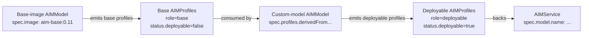

# Custom Models

A **custom model** lets you deploy a model whose architecture isn't published in the AMD AIM catalog. You combine a generic AIM base image — which supplies the runtime, engine, and tested accelerator profiles — with your own model weights pulled from S3, HuggingFace, or any other supported source.

!!! info "v1alpha2"
    Custom models use the `aim.eai.amd.com/v1alpha2` API. The v1alpha1 `spec.custom` / `spec.modelSources` flow on `AIMModel` is deprecated and removed from v1alpha2.

## When to use this flow

| Goal | Use this flow? |
|---|---|
| Deploy a model whose architecture **is** in the AMD AIM catalog (with your own fine-tune weights) | No — use [Fine-Tuned Models](fine-tuned-models.md) |
| Deploy a model whose architecture **is not** in the AMD AIM catalog | **Yes** |
| Deploy a published AIM image without modification | No — apply the AIMModel and you're done |

## Mental model

The flow has two AIMModels working together:



1. **Base-image model** — points `spec.image` at an AIM base image and produces **base AIMProfiles**: one per accelerator/precision combination the base image ships, with no `aimId` or `modelSources` populated. Base profiles are not deployable on their own — they exist only as derivation sources.

2. **Custom-model AIMModel** — uses `spec.profiles.derivedFrom` to select those base profiles and overlay your model identity and weights. The result is a set of regular **deployable AIMProfiles** that an `AIMService` can resolve through.

The base-image model is typically applied once by the platform team and reused across many custom-model derivations.

## Prerequisites

To use a container as a base image for custom models, it must:

- Ship profile YAMLs under `/workspace/aim-runtime/profiles/general/`. The v1alpha2 discovery walker only scans `general/` when the image's `AIM_ID` is empty (which is the case for a generic base image).
- Populate `aim_id` in each profile YAML — or leave it empty. If empty, the derivation supplies the architecture identity via `overrides.aimId` (see [Identity stamping](#identity-stamping) below). Both are supported.
- Leave `model_id` and `model_sources` empty in those YAMLs. That's what makes a profile a "base profile" rather than a published deployable.

Base profile YAMLs **do** carry `precision`, `metric`, `acceleratorModel`, `acceleratorCount`, and `engineArgs` — these are intrinsic tuning artefacts of the base image and the whole reason a base profile is useful as a derivation source. Derivation copies them through to each derived profile (unless an `overrides.*` field replaces them), so a base image that ships one (MI300X, fp8, latency) profile and one (MI325X, fp16, throughput) profile produces two derived deployable profiles per model.

AMD publishes `amdenterpriseai/aim-base` as a ready-to-use base image. You can also build your own following the layout described above.

## Step 1: Apply the base-image AIMModel

```yaml
apiVersion: aim.eai.amd.com/v1alpha2
kind: AIMModel
metadata:
  name: aim-base-vllm
  namespace: ml-team
spec:
  image: amdenterpriseai/aim-base:0.11
  imagePullSecrets:
    - name: registry-creds
  serviceAccountName: aim-runtime
```

Discovery runs as a Kubernetes Job that inspects the image and writes its profile catalog into a `ConfigMap` (referenced by `status.discoveryCacheRef`). For each supported profile in the catalog, the model controller creates a base `AIMProfile`.

Wait for discovery to complete and base profiles to materialise:

```bash
kubectl -n ml-team get aimmodel aim-base-vllm \
  -o jsonpath='{.status.managedProfiles}'
# {"deployable":0,"notAvailable":0,"ready":8,"base":8,"total":8}
```

`base > 0` and `deployable == 0` is the canonical "this is a base-image model" signal.

The base profiles themselves carry distinct labels and status:

```bash
kubectl -n ml-team get aimprofile \
  -l aim.eai.amd.com/source-model=aim-base-vllm \
  -o custom-columns=NAME:.metadata.name,ROLE:.metadata.labels.aim\\.eai\\.amd\\.com/profile-role,DEPLOYABLE:.status.deployable
# NAME                                 ROLE  DEPLOYABLE
# aim-base-vllm-general-fp8-lat-...    base  false
# aim-base-vllm-general-fp16-lat-...   base  false
# ...
```

## Step 2: Apply the custom-model AIMModel

```yaml
apiVersion: aim.eai.amd.com/v1alpha2
kind: AIMModel
metadata:
  name: acme-custom-transformer
  namespace: ml-team
spec:
  profiles:
    derivedFrom:
      selector:
        role: base
        modelRef:
          name: aim-base-vllm
          scope: Namespace
    versionPolicy: all
    overrides:
      aimId: acme/custom-transformer
      modelId: acme/custom-transformer
      modelSources:
        - modelId: acme/custom-transformer
          sourceUri: s3://acme-models/custom-transformer
  imagePullSecrets:
    - name: registry-creds
  serviceAccountName: aim-runtime
```

The spec splits cleanly into "what to filter" (`selector`) and "what to stamp on the derived profile" (`overrides`):

| Field | Half | Purpose |
|---|---|---|
| `selector.role: base` | filter | Match only base profiles. Required — without this, only already-deployable profiles are considered and no base profiles match. |
| `selector.modelRef.name` | filter | Pin the derivation to one specific base-image AIMModel. Without this, every base-image model in scope contributes candidates. |
| `overrides.aimId` | stamp | Target architecture identifier for the derived profile. **Required by CEL when `selector.role=base`** — base profiles ship with empty identity. |
| `overrides.modelId` | stamp | Target model identifier. **Required by CEL when `selector.role=base`**. |
| `overrides.modelSources` | stamp | The BYO weights that complete the base into a deployable profile. |

CEL validation on `AIMModelProfilesSpec` enforces the split: setting `selector.aimId`, `selector.modelId`, or `selector.profileId` when `selector.role=base` is rejected at admission time. Identity fields on the selector were a filter on the source (matching the source's identity); base profiles by design have no source identity, so the field is meaningless there.

When `overrides.modelId` is unset and `overrides.modelSources[0].modelId` is, the derived profile's `spec.modelId` auto-derives from the latter. The explicit override always wins, and is required for `role=base` regardless of `modelSources`.

Wait for the derivation to produce deployable profiles:

```bash
kubectl -n ml-team get aimmodel acme-custom-transformer \
  -o jsonpath='{.status.managedProfiles}'
# {"deployable":8,"notAvailable":0,"ready":8,"base":0,"total":8}
```

`kubectl get aimmodel` shows the resolved flow under the `KIND` column — a correctly-configured custom model surfaces as `Custom`. If you see `Image` there, your spec is using `spec.image` (the official flow) rather than `spec.profiles.derivedFrom`; if you see `Derived`, the selector is matching deployable rather than base profiles. See [`status.kind`](../concepts/models.md#status-fields) for the full discriminator table.

## Step 3: Deploy with an AIMService

```yaml
apiVersion: aim.eai.amd.com/v1alpha2
kind: AIMService
metadata:
  name: acme-custom-transformer-service
  namespace: ml-team
spec:
  model:
    name: acme-custom-transformer
```

The AIMService resolver treats `spec.model.name` as a shortcut for "every deployable profile produced by this model" and ranks the surviving candidates by `primary > type > version`. See [Deploying Services](deploying-services.md) for the other resolution shapes (by-profile-name, by-selector, with profile overlay).

## Identity stamping

Target identity for the derived profile lives entirely in `overrides`. The selector is filter-only.

| Field | Behaviour | Required when `role=base`? |
|---|---|---|
| `overrides.aimId` | Stamped on derived profile. Wins over the source's `spec.aimId` if both are set. | Yes (CEL) |
| `overrides.modelId` | Stamped on derived profile. Wins over the source's `spec.modelId` AND over `modelSources[0].modelId` auto-derivation. | Yes (CEL) |
| `overrides.profileId` | Stamped on derived profile. Wins over the source's `spec.profileId`. | No |

For `role=deployable` remixes (where you're re-derivating an already-deployable profile to e.g. expand across accelerator variants), all three identity overrides are optional — the source profile's existing identity carries through if you don't override it. For `role=base` derivations they're required (well, `aimId` and `modelId`) because the source has no identity to inherit.

This is enforced at admission time by CEL on both `AIMProfileSetSpec` and `AIMModelProfilesSpec`:

```text
selector.aimId/modelId/profileId are not allowed when selector.role=base;
set overrides.aimId/modelId/profileId instead (base profiles have no
source identity to filter on)

selector.role=base requires overrides.aimId and overrides.modelId
(base profiles carry no identity of their own; overrides supply it)
```

So an attempt to set `selector.aimId` under `selector.role=base` is rejected by the API server before reaching the controller.

## Common patterns

### Filter base profiles by accelerator

A base image typically ships profiles for several GPUs. Narrow the derivation to just the ones you want:

```yaml
spec:
  profiles:
    derivedFrom:
      selector:
        role: base
        modelRef:
          name: aim-base-vllm
        acceleratorModel: MI300X
        acceleratorCount: 2
    overrides:
      aimId: acme/custom-transformer
      modelId: acme/custom-transformer
      modelSources:
        - modelId: acme/custom-transformer
          sourceUri: s3://acme-models/custom-transformer
```

### Pin to a specific precision

```yaml
spec:
  profiles:
    derivedFrom:
      selector:
        role: base
        modelRef:
          name: aim-base-vllm
        precision: fp8
        metric: latency
    overrides:
      aimId: acme/custom-transformer
      modelId: acme/custom-transformer
      modelSources:
        - modelId: acme/custom-transformer
          sourceUri: s3://acme-models/custom-transformer
```

### Authenticate to private weights

`overrides.modelSources[].env` accepts the same credential references as a normal profile:

```yaml
spec:
  profiles:
    derivedFrom:
      selector:
        role: base
        aimId: acme/custom-transformer
        modelRef:
          name: aim-base-vllm
    overrides:
      modelSources:
        - modelId: acme/custom-transformer
          sourceUri: s3://acme-models/custom-transformer
          env:
            - name: AWS_ACCESS_KEY_ID
              valueFrom:
                secretKeyRef:
                  name: s3-credentials
                  key: access-key
            - name: AWS_SECRET_ACCESS_KEY
              valueFrom:
                secretKeyRef:
                  name: s3-credentials
                  key: secret-key
```

### Cluster-scoped variant

For platform-managed custom models that should be visible across namespaces, use `AIMClusterModel` with the same `spec.profiles` shape. The derivation will produce `AIMClusterProfile` objects instead of namespace-scoped ones, and `modelRef.scope` can be set to `Cluster` to pin to a cluster-scoped base-image model.

## Troubleshooting

### Base-image model status shows `base: 0`

Discovery hasn't found any profiles to materialise. Common causes:

- The base image's profile YAMLs aren't under `/workspace/aim-runtime/profiles/general/`.
- The image has `AIM_ID` set, so discovery is looking under `$AIM_ID/` instead of `general/`.
- The profile YAMLs populate `model_id` or `model_sources` — they're treated as deployable, not base.

Inspect the discovery cache:

```bash
kubectl -n ml-team get aimmodel aim-base-vllm \
  -o jsonpath='{.status.discoveryCacheRef.name}'
# aim-base-vllm-discovery-<hash>
kubectl -n ml-team get configmap aim-base-vllm-discovery-<hash> -o yaml
```

### Custom-model AIMModel is `NotAvailable` with `NoMatchingProfiles`

The selector matched zero base profiles. Verify:

```bash
# Check that base profiles exist under the modelRef
kubectl -n ml-team get aimprofile \
  -l aim.eai.amd.com/source-model=aim-base-vllm,aim.eai.amd.com/profile-role=base

# Check the derivation's profile set
kubectl -n ml-team get aimmodel acme-custom-transformer \
  -o jsonpath='{.status.profileSetRef.name}'
kubectl -n ml-team get aimprofileset <profileset-name> -o yaml
```

Common causes:

- `selector.modelRef.name` doesn't match the base-image model's metadata name.
- `selector.modelRef.scope` mismatches the base-image model's scope (use `Auto` if unsure).
- An accelerator/precision filter excluded every candidate.

### AIMService stuck in `Pending` with `ProfileNotFound`

Confirm the derivation produced deployable profiles before debugging the service:

```bash
kubectl -n ml-team get aimmodel acme-custom-transformer \
  -o jsonpath='{.status.managedProfiles}'
```

If `deployable == 0`, fix the derivation first. If `deployable > 0`, the service-side resolver isn't finding them — check that the service's `spec.model.name` matches the custom-model AIMModel's name exactly, and that any `spec.profile.selector` you set doesn't narrow more than the available profiles.

## Next Steps

- [Fine-Tuned Models](fine-tuned-models.md) — Derive from existing official AIM profiles instead of base-image base profiles
- [Deploying Services](deploying-services.md) — Resolution shapes and overlay patterns for `AIMService`
- [AIM Models](../concepts/models.md) — Full lifecycle of all three model flows
- [AIM Profile Sets](../concepts/profilesets.md) — The derivation machinery underneath `spec.profiles`
- [Profiles](../concepts/profiles.md) — Base vs deployable, provenance labels, status fields
