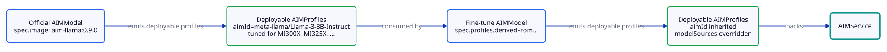

# Fine-Tuned Models

A **fine-tuned model** reuses an existing official AIM model's runtime profiles — its `aim-base` runtime, tuned engine arguments, accelerator pairings, and benchmarked precisions — and swaps in your fine-tune weights. You get the same performance characteristics as the published model with no re-tuning work.

:::{admonition} v1alpha2
:class: note

Fine-tuned models use the `aim.eai.amd.com/v1alpha2` API. The v1alpha1 fine-tune path via `spec.profileCopy` is replaced by `spec.profiles`.
:::
## When to use this flow

| Goal | Use this flow? |
|---|---|
| Deploy a fine-tune of a published AIM model (same architecture, different weights) | **Yes** |
| Deploy a model whose architecture is **not** in the AMD AIM catalog | No — use [Custom Models](custom-models.md) |
| Deploy a published AIM image unmodified | No — apply the AIMModel and you're done |

## Mental model

A fine-tuned model is a single AIMModel that derives from an already-existing official AIMModel: you inherit the published model's tuned engine arguments, accelerator pairings, and benchmarked precisions, and swap in your weights via `modelSources`. Because the override replaces the weights, each derived profile's image resolves back to the official model's `aim-base` runtime (rebased onto its registry+org) — the model-optimized image is specific to the published weights, so your fine-tune loads onto the clean base runtime instead. See [Image resolution](../concepts/profilesets.md#image-resolution) for how the derived image is chosen.

<picture>
  <source media="(prefers-color-scheme: dark)" srcset="../assets/diagrams/fine-tuned-flow-dark.svg">
  
</picture>

The official AIMModel is typically applied once by the platform team or auto-discovered via `AIMClusterModelSource`. Your fine-tune AIMModel reuses its profiles read-only.

## Prerequisites

- An existing official `AIMModel` or `AIMClusterModel` whose architecture matches your fine-tune. Confirm it has at least one deployable profile:

  ```bash
  kubectl get aimmodel <official-model> \
    -o jsonpath='{.status.managedProfiles}'
  # {"deployable":5,"notAvailable":0,"ready":5,"base":0,"total":5}
  ```

- The `aimId` value the official model uses (this is your match key). Read it from any of its profiles:

  ```bash
  kubectl get aimprofile -l aim.eai.amd.com/source-model=<official-model> \
    -o jsonpath='{.items[0].spec.aimId}'
  # meta-llama/Llama-3-8B-Instruct
  ```

## Step 1: Apply the fine-tune AIMModel

```yaml
apiVersion: aim.eai.amd.com/v1alpha2
kind: AIMModel
metadata:
  name: llama-3-8b-finetune-acme
  namespace: ml-team
spec:
  profiles:
    derivedFrom:
      selector:
        aimId: meta-llama/Llama-3-8B-Instruct
        acceleratorModel: MI300X
        engineArgs:
          tensor-parallel-size: 1
    versionPolicy: pinned
    version: "0.9.0"
    overrides:
      modelSources:
        - modelId: acme/llama-3-8b-finetune
          sourceUri: hf://acme/llama-3-8b-finetune
  imagePullSecrets:
    - name: hf-creds
  serviceAccountName: aim-runtime
```

`selector.aimId` is the **match key** against the source profiles — every candidate must have this exact `spec.aimId`. The derived profiles inherit `aimId` from their sources.

Optional selector fields narrow the candidate pool:

| Field | Purpose |
|---|---|
| `acceleratorModel` | Match profiles tuned for a specific GPU (`MI300X`, `MI325X`, …) |
| `acceleratorCount` | Match a specific tensor-parallel topology |
| `precision` | Match a specific precision (`fp8`, `fp16`, …) |
| `metric` | Match `latency` or `throughput` profiles |
| `engineArgs` | Partial match on engine args; every provided key must equal the source's value |
| `modelRef.name` | Restrict to profiles produced by a specific AIMModel (useful when multiple models share an `aimId`) |

### Version policy

`versionPolicy` controls how the selector matches across multiple versions of the source profiles:

| Policy | Behavior |
|---|---|
| `pinned` | Match only profiles whose version (extracted from `spec.image` tag) equals `spec.version`. Requires `version` to be set. |
| `latest` | Match only the highest-version profile in each (accelerator, precision, metric) group. |
| `all` | Match every profile that satisfies the selector, regardless of version. |

`pinned` gives reproducibility — your fine-tune always uses the same upstream tuning. `latest` auto-tracks upstream improvements as new official profiles are published. `all` is rarely useful for fine-tunes and is more common for the [custom-model](custom-models.md) flow.

### Overrides

`overrides.modelSources` replaces the source profile's model sources with your fine-tune weights. `ApplyProfileCopyOverrides` automatically copies `modelSources[0].modelId` into the derived profile's `spec.modelId`, so the cache path tracks your weights.

Additional overrides:

| Override | Behavior |
|---|---|
| `containerEnv` | Merges by env-var name; source entries with matching names are replaced, new names are appended |
| `engineEnv` | Same merge semantics as `containerEnv` |
| `engineArgs` | Shallow merge over source `engineArgs`; matching keys are replaced |
| `acceleratorModel` / `acceleratorCount` | Replaces the source values outright |

## Step 2: Verify deployable profiles

```bash
kubectl -n ml-team get aimmodel llama-3-8b-finetune-acme \
  -o jsonpath='{.status.managedProfiles}'
# {"deployable":3,"notAvailable":0,"ready":3,"base":0,"total":3}
```

`kubectl get aimmodel` shows the resolved flow under the `KIND` column — a correctly-configured fine-tune surfaces as `Derived`. If you see `Custom` there, the selector is matching base-image base profiles instead of an existing deployable model (you want [Custom Models](custom-models.md) in that case). See [`status.kind`](../concepts/models.md#status-fields) for the full discriminator table.

All managed profiles should be deployable. Inspect one to confirm the overrides applied:

```bash
kubectl -n ml-team get aimprofile \
  -l aim.eai.amd.com/source-model=llama-3-8b-finetune-acme \
  -o jsonpath='{.items[0].spec}' | jq '{aimId, modelId, modelSources}'
# {
#   "aimId": "meta-llama/Llama-3-8B-Instruct",
#   "modelId": "acme/llama-3-8b-finetune",
#   "modelSources": [
#     {
#       "modelId": "acme/llama-3-8b-finetune",
#       "sourceUri": "hf://acme/llama-3-8b-finetune"
#     }
#   ]
# }
```

`aimId` is inherited from the source profile; `modelId` and `modelSources` come from the overrides.

## Step 3: Deploy with an AIMService

```yaml
apiVersion: aim.eai.amd.com/v1alpha2
kind: AIMService
metadata:
  name: llama-finetune-service
  namespace: ml-team
spec:
  model:
    name: llama-3-8b-finetune-acme
```

`spec.model.name` resolves to the deployable profiles produced by the fine-tune AIMModel and ranks them by `primary > type > version`. Add `spec.profile.selector` to narrow further (for example, force `precision: fp8`).

## Common patterns

### Derive across all precisions

When you want fine-tune profiles for every precision the upstream model ships:

```yaml
spec:
  profiles:
    derivedFrom:
      selector:
        aimId: meta-llama/Llama-3-8B-Instruct
        acceleratorModel: MI300X
    versionPolicy: latest
    overrides:
      modelSources:
        - modelId: acme/llama-3-8b-finetune
          sourceUri: hf://acme/llama-3-8b-finetune
```

Every MI300X profile from the latest upstream version is derived.

### Override engine args for fine-tune-specific tuning

```yaml
spec:
  profiles:
    derivedFrom:
      selector:
        aimId: meta-llama/Llama-3-8B-Instruct
        precision: fp8
    versionPolicy: pinned
    version: "0.9.0"
    overrides:
      modelSources:
        - modelId: acme/llama-3-8b-finetune
          sourceUri: hf://acme/llama-3-8b-finetune
      engineArgs:
        max-model-len: 16384
```

The derived profile inherits the source's `engineArgs` and shallow-merges your override on top — `max-model-len` is replaced, everything else is preserved.

### Cluster-scoped variant

For platform-managed fine-tunes that should be visible across namespaces, use `AIMClusterModel` with the same `spec.profiles` shape. The derivation will produce `AIMClusterProfile` objects, and `selector.modelRef.scope: Cluster` can pin to a cluster-scoped source model.

### Private weights

Most fine-tune sources are gated. Provide pull credentials via either:

- A per-source `env` entry on `overrides.modelSources[].env` (HuggingFace `HF_TOKEN`, S3 keys, OCI registry secrets, etc.), or
- A namespace `AIMRuntimeConfig` that injects the credential into every downloader job in the namespace.

See [Private Registries](private-registries.md) for the full credential model and the recommended secret layout.

## Troubleshooting

### AIMModel is `NotAvailable` with `NoMatchingProfiles`

The selector matched zero source profiles. Common causes:

- `selector.aimId` doesn't exactly match the official model's profiles. Verify:

  ```bash
  kubectl get aimprofile -A \
    -o jsonpath='{range .items[*]}{.metadata.namespace}/{.metadata.name}: {.spec.aimId}{"\n"}{end}' \
    | grep -i llama
  ```

- `versionPolicy: pinned` is set but `version` doesn't match any source's version tag. Check the source profiles' `status.version`.
- An accelerator or precision filter excluded every candidate — relax it or check that the official model ships those combinations.

### AIMService stuck in `Pending` with `ProfileNotFound`

Confirm the derivation produced deployable profiles before debugging the service. If `managedProfiles.deployable > 0` but the service can't find them, check that the service's `spec.model.name` matches the fine-tune AIMModel's name exactly.

### Source profile updates not reflected in derived profiles

With `versionPolicy: pinned`, the derivation is locked to a specific upstream version. To pick up upstream changes, either bump `spec.version` on the fine-tune AIMModel or switch to `versionPolicy: latest`.

## Next Steps

- [Custom Models](custom-models.md) — Derive from base-image base profiles when no official model matches your architecture
- [Deploying Services](deploying-services.md) — Resolution shapes and overlay patterns for `AIMService`
- [AIM Models](../concepts/models.md) — Full lifecycle of all three model flows
- [AIM Profile Sets](../concepts/profilesets.md) — The derivation machinery underneath `spec.profiles`
- [Profiles](../concepts/profiles.md) — Provenance labels, status fields, override semantics
