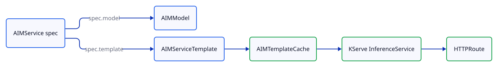

# AIMService (v1alpha1)

:::{admonition} Deprecated
:class: warning

The v1alpha1 `AIMService` shape (`spec.template`, `spec.overrides`) is deprecated. New deployments should use [v1alpha2 AIMService](../concepts/services.md), which references profiles instead of templates. See [Migrating to v1alpha2](migrating.md) for conversion recipes.
:::
This page documents the legacy template-based `AIMService` shape. The v1alpha2 service shape (`spec.profile`) coexists in the same CRD — see [Services](../concepts/services.md) for the current model.

## v1alpha1 lifecycle

<picture>
  <source media="(prefers-color-scheme: dark)" srcset="../assets/diagrams/aimservice-v1alpha1-lifecycle-dark.svg">
  
</picture>

The controller resolves a model and a template, optionally creates a template cache, and produces a KServe `InferenceService`.

## Spec fields (v1alpha1 path)

| Field | Description |
|---|---|
| `spec.model.name` | References an `AIMModel` / `AIMClusterModel` by name. |
| `spec.model.image` | References a container image directly; auto-creates a model if needed. |
| `spec.template.name` | Pin a specific `AIMServiceTemplate` / `AIMClusterServiceTemplate`. |
| `spec.template.selectionCriteria` | Auto-select a template by `precision`, `metric`, `acceleratorModel`, `acceleratorCount`, `engine`. |
| `spec.overrides` | Override template runtime parameters (engineArgs, env, ...). |
| `spec.caching.mode` | `Shared` (default) or `Dedicated`. |
| `spec.replicas` / `minReplicas` / `maxReplicas` | Fixed or KEDA-autoscaled replicas. |
| `spec.runtimeConfigRef.name` | Reference an `AIMRuntimeConfig` / `AIMClusterRuntimeConfig`. |

## Resolution

v1alpha1 resolution proceeds in two steps:

1. **Model resolution** — `spec.model.name` looks up namespace-then-cluster, or `spec.model.image` auto-creates a model. Recorded in `status.resolvedModel`.
2. **Template resolution** — `spec.template.name` looks up the specific template; `spec.template.selectionCriteria` evaluates a scoring algorithm against discovered templates. Recorded in `status.resolvedTemplate`.

The v1alpha2 resolution model collapses these into a single profile resolution — see [Services](../concepts/services.md#resolution-shapes).

## Selection algorithm (template path)

When `spec.template.selectionCriteria` is set, the controller filters and scores discovered templates:

1. **Filter** by precision, accelerator type/model/count, metric, engine.
2. **Filter** by GPU availability on cluster nodes.
3. **Score** by `primary > type (optimized > general > preview > unoptimized) > version`.
4. **Tie-break** by template name (alphabetical) for determinism.

The same algorithm runs in v1alpha2 but operates on profiles instead of templates.

## Conditions (v1alpha1 path)

When an AIMService uses `spec.template`, the controller emits these conditions:

| Condition | Status | Reason |
|---|---|---|
| `ModelReady` | `True` | `ModelResolved` |
| `ModelReady` | `False` | `ModelNotFound`, `ModelNotReady`, `CreatingModel`, `InvalidImageReference` |
| `TemplateReady` | `True` | `Resolved` |
| `TemplateReady` | `False` | `TemplateNotFound`, `TemplateNotReady`, `TemplateSelectionAmbiguous` |
| `CacheReady` | `True` | `CacheReady` |
| `CacheReady` | `False` | `CacheCreating`, `CacheNotReady`, `CacheFailed`, `CacheLost` |
| `InferenceServiceReady` | `True` | `RuntimeReady` |
| `InferenceServiceReady` | `False` | `CreatingRuntime`, `RuntimeScaling` |

See [Legacy Conditions Reference](conditions-v1alpha1.md) for the full catalog.

## Coexistence with v1alpha2

A single AIMService **cannot** mix `spec.template` and `spec.profile` — admission rejects the combination. The CRD validation reads:

```
spec.profile and spec.template are mutually exclusive
one of spec.model or spec.profile must be specified
```

This means a migration from v1alpha1 to v1alpha2 on a given service is an atomic flip — remove `spec.template`, add `spec.profile`, apply.

## Migration

See [Migrating to v1alpha2 — AIMService](migrating.md#aimservice) for field-by-field conversion examples.

The shortest path: replace `spec.template.selectionCriteria` with `spec.profile.selector` (same field names, different parent path). Replace `spec.template.name` with `spec.profile.name`. The names produced by v1alpha2 discovery match the v1alpha1 template profile names in most cases.

## Related documentation

- [Migrating to v1alpha2](migrating.md)
- [Service Templates (v1alpha1)](service-templates.md)
- [Services (v1alpha2)](../concepts/services.md) — Migration target
- [Deploying Services](../guides/deploying-services.md) — Current guide (v1alpha2-first)
